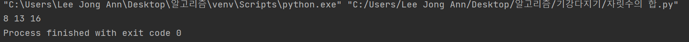
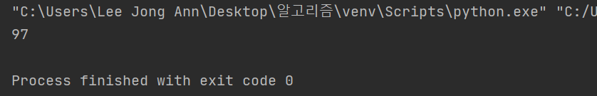

# Even-earthworms-can-understand-Algorithms
Data Structure &amp; Algorithms

# Data-Structure and Algorithms

[K번째 약수 해설](#K번째-약수-해설)    
[자릿수의 합 해설](#자릿수의-합-해설)   
[에라토스테네스의 체 만들기](#에라토스테네스의-체-만들기)   
[보여지는 텍스트](#이동할위치의텍스트)
~생략~

# K번째 약수 해설

> 입력값이 8 4 일 때 8의 약수 중에서 4번째 값을 구하는 문제이다 
그렇다면 어떻게 구해야 될까? 우선은 8의 약수들을 구해야 된다.

### 1) 첫번째 할 일 8의 약수 구하기

---

8의 약수를 구하기 위해서는 다음과 같은 식이 필요하다  

    for i in range(1,n): -> 반복문이 돌면서 1부터 자기 자신까지 돌아간뒤 
    
    if n % i == 0: -> n을 1부터 8의 숫자까지 한번씩 나누어서 0이 되는 수를 구한다
       
    cnt+= 1 -> 0이 되는 값을 cnt 라는 변수에 저장한뒤 하나씩 증가시킨다

---

### 2) 두번째 할 일 8의 4번째 약수를 구하기

> 여기서 이제 약수의 값을 구하는 것은 끝이 났다. 그렇다면 4번째의 약수는 어떻게 구해야 할까?

---

우리는 cnt라는 변수를 하나 생성해서 0으로 떨어질 때마다 
값을 하나씩 카운트 해서 올렸다.

그러면 그 값이 구하려는 K값과 일치하면 cnt값이 
k번째 값을 구한다는 것을 알 수 있다.

그러면 코드로 써보면 

    if cnt == k: -> 하나씩 증가된 cnt 값이 k값과 일치한다면

    print(i) -> 해당하는 i번째를 출력한다. 즉 i가 8일 때는 cnt값이 계속 증가돼서 4가 되게 되고
                4는 k값과 일치하므로 즉 4번째 약수는 8이 된다는 것을 알 수 있다.

이렇게 나타낼 수 있겠다.   
전체 코드는 다음과 같다.   
>import sys  
>sys.stdin = open("in1.txt", "rt")  
>n,k = map(int, input().split())  
cnt = 0  
for i in range(1,n+1):  
    if n%i == 0:  
        cnt += 1  
    if cnt == k:  
        print(i)  
        break  
else:  
    print(-1)

---

# 자릿수의 합 해설 

> 1. 다음과 같은 입력값이 주어질 때 각 자리수의 합을 구하는 문제이다   
> 125 15232 97 
---

> 자릿수가 저렇게 주어졌을때 각 자리수는 어떻게 될지 보면   
> 125 - > 8  
> 12532 - > 13   
> 97 - > 16   
> 이런식으로 문제가 나와야 한다. (각 자리수를 구하는 것이므로)
***
그렇다면 이제 문제를 이해했으므로 풀이를 생각해보자   
각 자리의 숫자는 어떻게 구해야될까? 

### ***바로 나눗셈으로 각 자리 숫자를 구할 수 있다.***

> 예를 들어서 125를 10으로 나누게 되면 몫은 12가 되고 나머지는 5가 된다.   
> 여기서 남은 12를 다시 10으로 나누게 되면 몫은 1이 되고 나머지는 2가 된다.   
> 그리고 다시 이 과정을 반복해주면 나머지는 1이 되며 1 , 2 , 5 의 값을 따로 구할 수 있게 되는 것이다.   
> 이것을 이용하여 각 자리 숫자를 구해준다.

***
앞에서 말한 내용을 코드로 구현하면 아래와 같다  
# 이동할위치의텍스트
> def digit_sum(x):  
    sum = 0  
    while x > 0:  
        sum += x % 10  
        x = x // 10  
    return sum  

***
그러면 이제 자릿수의 합을 구하는 함수를 구했으니   
이제 이 중에서 가장 큰 값들을 구하는 함수를 구해야 한다.   
각각 구한 값들을 어떤 변수에 담고 ,   
max값을 어떤 특정 값으로 설정한 다음 반복문이 돌아가면서 비교한   
값과 max값을 비교하여 반복문에서 구한 값이 더 크다면 max값에 집어넣어준다.  
코드로 표현하면 아래와 같다
> for x in a:  
    tot = digit_sum(x)  
    if tot > max:  
        max = tot  
        res = x    

3   
125 15232 97가 입력값일때 자릿수의 합이 최대값인 수는 97이다

전체 코드는 아래와 같다.  
> import sys

>sys.stdin = open("in5.txt", "r")  

>n = int(input())  
a = list(map(int, input().split()))  
res = 0  
max = -2147000000  

>def digit_sum(x):  
    sum = 0  
    while x > 0:  
        sum += x % 10  
        x = x // 10  
    return sum  
for x in a:  
    tot = digit_sum(x)  
    if tot > max:
        max = tot
        res = x
>print(res)

자릿수의 합 해설 끝

# 에라토스테네스의 체 만들기 

1부터 특정 수까지 있다고 할 때 그러면 소수는 어떻게 구해야 될까?
그러면 소수라는 것은 또 무엇일까? 이 문제는 고대 그리스의 에라토스테네스[^에라토스테네스]라는 사람이 
고안해낸 방법으로 이번 시간에는 이와 같은 의문에 대해서 
알아보고 코드로 구현해 보겠다. 

***   
[에라토스테네스]: 에라토스테네스(Ερατοσθένης, 기원전 274년 ~ 기원전 196년)는 고대 그리스의 수학자이자 천문학자이다. 헬레니즘 시대 이집트에서 활약했으며, 문헌학 및 지리학을 비롯해 헬레니즘 시대 학문 다방면에 걸쳐 업적을 남겼지만, 특히 수학과 천문학의 분야에서 후세에 남는 큰 업적을 남겼다.
